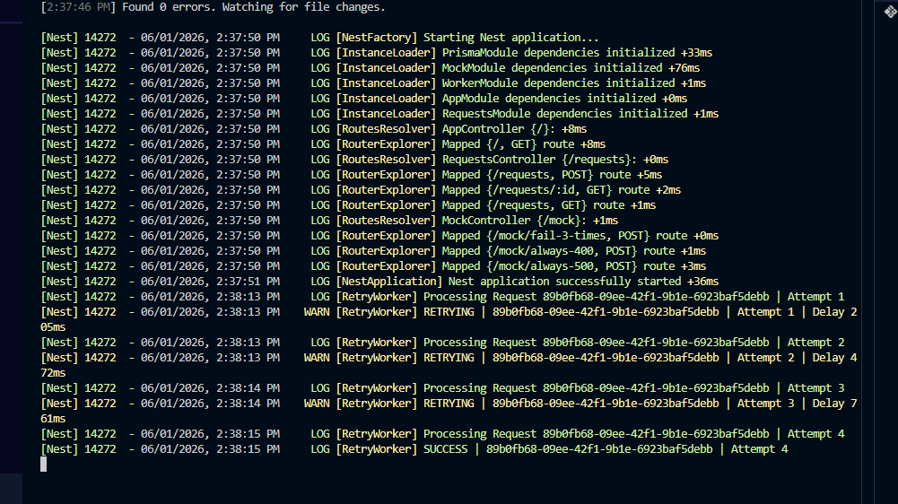
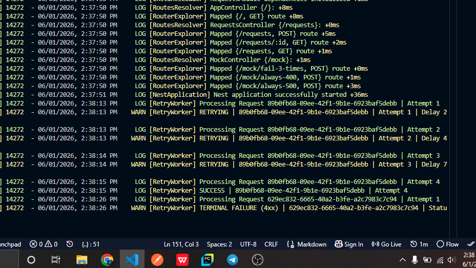
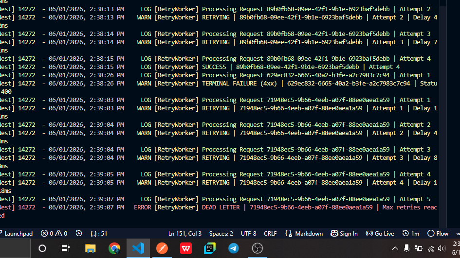

# Retry Engine (Backend Resilience System)

A production-style retry engine built with **NestJS, Prisma, and SQLite** that demonstrates how real-world systems handle unreliable external APIs using **exponential backoff and jitter**.

This project simulates how services like payment gateways, SMS providers, and third-party APIs recover from failures safely and efficiently.

---

# Features

- POST `/request` to schedule external HTTP calls
- Background worker processing every 500ms
- Exponential backoff retry strategy
- Random jitter to prevent retry storms
- Retry only on:
  - 5xx server errors
  - network errors
  - timeouts
- No retry on 4xx errors (terminal failure)
- Dead-letter handling after max retries
- Full attempt history tracking in database
- Request status lifecycle:
  - `PENDING`
  - `RETRYING`
  - `COMPLETED`
  - `FAILED`

---

# Tech Stack

- NestJS (Backend Framework)
- Prisma ORM
- SQLite (Database)
- Axios (HTTP client)
- TypeScript

---

# Setup Instructions

## Install dependencies
```bash
npm install

```

# Setup database
```bash
npx prisma migrate dev
npx prisma generate
Start server
npm run start:dev
```

# Server runs on:

 http://localhost:3000


# API Endpoints
 Create Request
POST /request
```bash
Request Body
{
  "url": "http://localhost:3000/mock/fail-3-times",
  "method": "POST",
  "body": null,
  "maxRetries": 5,
  "backoffMs": 1000
}

Response:
{
  "id": "uuid",
  "status": "PENDING"
}
```

# Get Request by ID
GET /requests/:id

Returns full request details including retry attempt history.

Get Requests by Status
GET /requests?status=failed

Filter requests by status.

Valid statuses:
pending
retrying
completed
failed

# Architecture Diagram
Client
  |
  | POST /request
  ↓
NestJS API Layer
  ↓
Prisma Database (Request Table)
  ↓
Background Worker (runs every 500ms)
  ↓
External API (Mock Service)
  ↓
Attempt Table (stores each retry attempt)
 Retry Strategy
 Exponential Backoff

# Each retry increases delay exponentially:

delay = baseBackoff * 2^attempt
# Why?
Prevents overwhelming failing services
Gives external APIs time to recover
Avoids cascading system failures
 Jitter (Randomization)

To avoid synchronized retry spikes:

finalDelay = exponentialBackoff * random(0.8 → 1.2)

# Why?
Prevents "thundering herd problem"
Spreads retry load over time
Improves system stability under high failure conditions

# Mock Endpoints (Testing)
1. Fail 3 times then succeed
POST /mock/fail-3-times

Used to test:

retry flow
backoff progression
eventual success
2. Always 400 (no retry case)
POST /mock/always-400

Used to test:

terminal failure behavior
no retry on 4xx
3. Always 500 (dead-letter test)
POST /mock/always-500

# Used to test:
retry exhaustion
dead-letter handling

# Required Screenshot

#  Evidence of Retry System Working
## 1. Successful retry flow (fail → retry → success)



---

## 2. 4xx terminal failure (no retry)



---

## 3. Max retries reached (dead-letter)




# Challenges Faced
Prisma migration and schema synchronization issues
Handling axios error responses consistently
Worker timing and scheduling correctness (500ms loop)
Correct implementation of exponential backoff formula
Ensuring retry vs non-retry error separation
Maintaining database consistency during retries\


# What I Learned
Designing background worker systems
Retry mechanisms in distributed systems
Exponential backoff + jitter strategies
Prisma relational data modeling
Handling unreliable external APIs
Building fault-tolerant backend systems


# Resources Used
Prisma Docs: https://www.prisma.io/docs
NestJS Docs: https://docs.nestjs.com
MDN HTTP Status Codes: https://developer.mozilla.org/en-US/docs/Web/HTTP/Status
AWS Architecture Patterns (Backoff strategies)
StackOverflow discussions on retry mechanisms
AI-assisted debugging and architecture guidance


# Why This Project Made Me a Better Backend Developer

This project taught me how real production systems handle failure safely.

I now understand:

why retries must be controlled
how uncontrolled retries can destroy services
how distributed systems avoid cascading failure
how timing, randomness, and state persistence matter in backend design

I can now design systems that:

recover automatically from external API failure
avoid overload during outages
track and audit every failure attempt